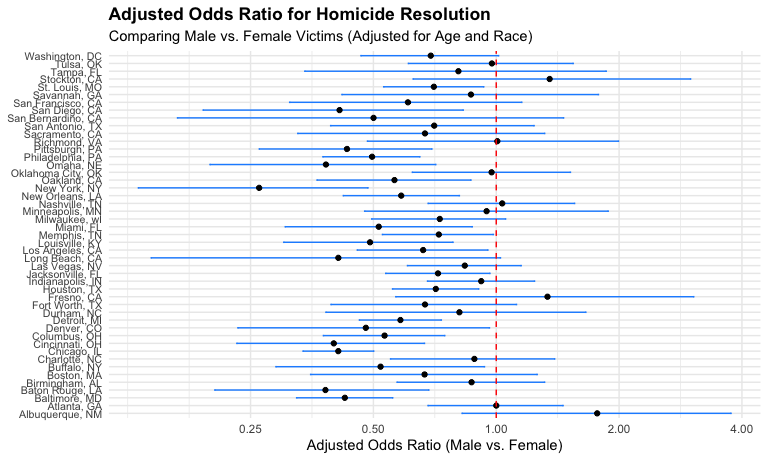
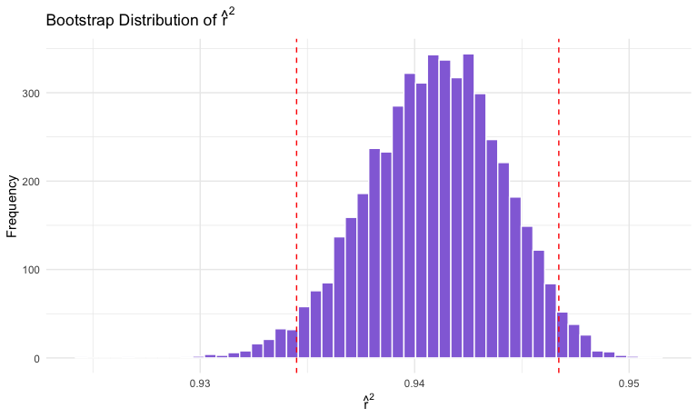
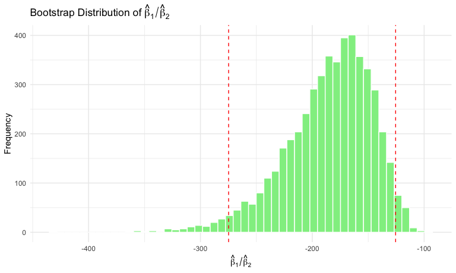
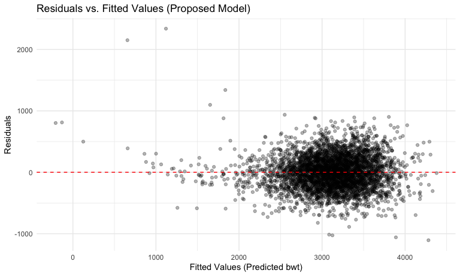

p8105_hw6_ls4236
================
Liliang Su
2025-11-16

## Problem 1

Load and clean data.

``` r
homi_df_raw =
  read_csv(file = "./data/homicide-data.csv", na = c("NA",".","")) |> 
  janitor::clean_names()
```

    ## Rows: 52179 Columns: 12
    ## ── Column specification ────────────────────────────────────────────────────────
    ## Delimiter: ","
    ## chr (9): uid, victim_last, victim_first, victim_race, victim_age, victim_sex...
    ## dbl (3): reported_date, lat, lon
    ## 
    ## ℹ Use `spec()` to retrieve the full column specification for this data.
    ## ℹ Specify the column types or set `show_col_types = FALSE` to quiet this message.

``` r
homi_df = homi_df_raw |> 
  mutate(
    city_state = str_c(city, ", ", state)
  ) |> 
  # binary indicator
  mutate(resolved = disposition == "Closed by arrest") |>
  # Omit specified cities
  filter(!city_state %in% c("Dallas, TX", "Phoenix, AZ", "Kansas City, MO", "Tulsa, AL")) |>
  # Limit analysis to 'white' or 'black' victims
  filter(victim_race %in% c("White", "Black")) |>
  # make sure victim_age is numeric
  mutate(victim_age = as.numeric(victim_age)) |> 
  mutate(victim_sex = factor(victim_sex, levels = c("Female", "Male")),
         victim_race = factor(victim_race, levels = c("Black", "White")))
```

    ## Warning: There was 1 warning in `mutate()`.
    ## ℹ In argument: `victim_age = as.numeric(victim_age)`.
    ## Caused by warning:
    ## ! NAs introduced by coercion

### Baltimore GLM Analysis

``` r
baltimore_df <- homi_df |>
  filter(city_state == "Baltimore, MD")

# Fit the logistic regression model
baltimore_model <- glm(
  resolved ~ victim_age + victim_sex + victim_race,
  family = binomial(link = "logit"),
  data = baltimore_df
)

# Apply tidy, get estimate and CIs for adjusted ORs
baltimore_results <- broom::tidy(baltimore_model, conf.int = TRUE, exponentiate = TRUE) |>
  # Filter for the Male coefficient (Male is level 2, Female is reference)
  filter(term == "victim_sexMale") |>
  select(estimate, conf.low, conf.high)

baltimore_results
```

    ## # A tibble: 1 × 3
    ##   estimate conf.low conf.high
    ##      <dbl>    <dbl>     <dbl>
    ## 1    0.426    0.324     0.558

The estimate of adjusted odds ratio for for solving homicides comparing
male victims to female victims keeping all other variables fixed is
0.4255117, and CI is (0.3241908, 0.5575508).

### Multi-cities GLM Analysis

``` r
# function to fit the model and extract the Male OR
glm_for_maleOR <- function(data) {
  
  # fit the model
  fit = glm(
    resolved ~ victim_age + victim_sex + victim_race,
    family = binomial(link = "logit"),
    data = data
    )
  
  # Extract OR and CI using broom
  tidy_results <- broom::tidy(fit, conf.int = TRUE, exponentiate = TRUE) |>
    filter(term == "victim_sexMale") |>
    select(estimate, conf.low, conf.high)
  
  return(tidy_results)
  }

# Run the analysis across all cities
cities_results <- homi_df |>
  group_by(city_state) |>
  nest() |>
  # Apply the function to each city's data
  mutate(tidy_results = map(data, glm_for_maleOR)) |>
  select(city_state, tidy_results) |>
  # Expand the list-column of ORs into rows
  unnest(tidy_results)

cities_results |> 
  knitr::kable()
```

| city_state         |  estimate |  conf.low | conf.high |
|:-------------------|----------:|----------:|----------:|
| Albuquerque, NM    | 1.7674995 | 0.8247082 | 3.7618597 |
| Atlanta, GA        | 1.0000771 | 0.6803477 | 1.4582575 |
| Baltimore, MD      | 0.4255117 | 0.3241908 | 0.5575508 |
| Baton Rouge, LA    | 0.3814393 | 0.2043481 | 0.6836343 |
| Birmingham, AL     | 0.8700153 | 0.5713814 | 1.3138409 |
| Boston, MA         | 0.6673219 | 0.3508461 | 1.2600381 |
| Buffalo, NY        | 0.5205704 | 0.2884416 | 0.9358300 |
| Charlotte, NC      | 0.8838976 | 0.5507440 | 1.3905954 |
| Chicago, IL        | 0.4100982 | 0.3361233 | 0.5008546 |
| Cincinnati, OH     | 0.3998277 | 0.2313767 | 0.6670456 |
| Columbus, OH       | 0.5324845 | 0.3770457 | 0.7479124 |
| Denver, CO         | 0.4790620 | 0.2327380 | 0.9624974 |
| Detroit, MI        | 0.5823472 | 0.4619454 | 0.7335458 |
| Durham, NC         | 0.8123514 | 0.3824420 | 1.6580169 |
| Fort Worth, TX     | 0.6689803 | 0.3935128 | 1.1211603 |
| Fresno, CA         | 1.3351647 | 0.5672553 | 3.0475080 |
| Houston, TX        | 0.7110264 | 0.5569844 | 0.9057376 |
| Indianapolis, IN   | 0.9187284 | 0.6784616 | 1.2413059 |
| Jacksonville, FL   | 0.7198144 | 0.5359236 | 0.9650986 |
| Las Vegas, NV      | 0.8373078 | 0.6058830 | 1.1510854 |
| Long Beach, CA     | 0.4102163 | 0.1427304 | 1.0241775 |
| Los Angeles, CA    | 0.6618816 | 0.4565014 | 0.9541036 |
| Louisville, KY     | 0.4905546 | 0.3014879 | 0.7836391 |
| Memphis, TN        | 0.7232194 | 0.5261210 | 0.9835973 |
| Miami, FL          | 0.5152379 | 0.3040214 | 0.8734480 |
| Milwaukee, wI      | 0.7271327 | 0.4951325 | 1.0542297 |
| Minneapolis, MN    | 0.9469587 | 0.4759016 | 1.8809745 |
| Nashville, TN      | 1.0342379 | 0.6807452 | 1.5559966 |
| New Orleans, LA    | 0.5849373 | 0.4218807 | 0.8121787 |
| New York, NY       | 0.2623978 | 0.1327512 | 0.4850117 |
| Oakland, CA        | 0.5630819 | 0.3637421 | 0.8671086 |
| Oklahoma City, OK  | 0.9740747 | 0.6228507 | 1.5199721 |
| Omaha, NE          | 0.3824861 | 0.1988357 | 0.7109316 |
| Philadelphia, PA   | 0.4962756 | 0.3760120 | 0.6498797 |
| Pittsburgh, PA     | 0.4307528 | 0.2626022 | 0.6955516 |
| Richmond, VA       | 1.0060520 | 0.4834671 | 1.9936248 |
| San Antonio, TX    | 0.7046200 | 0.3928179 | 1.2382509 |
| Sacramento, CA     | 0.6688418 | 0.3262733 | 1.3143887 |
| Savannah, GA       | 0.8669817 | 0.4185827 | 1.7802453 |
| San Bernardino, CA | 0.5003444 | 0.1655367 | 1.4623977 |
| San Diego, CA      | 0.4130248 | 0.1913527 | 0.8301847 |
| San Francisco, CA  | 0.6075362 | 0.3116925 | 1.1551470 |
| St. Louis, MO      | 0.7031665 | 0.5298505 | 0.9319005 |
| Stockton, CA       | 1.3517273 | 0.6256427 | 2.9941299 |
| Tampa, FL          | 0.8077029 | 0.3395253 | 1.8598834 |
| Tulsa, OK          | 0.9757694 | 0.6090664 | 1.5439356 |
| Washington, DC     | 0.6910490 | 0.4659731 | 1.0135014 |

``` r
# Create the plot
cities_plot <- cities_results |>
  # Reorder city_state factor by the OR estimate
  mutate(city_state = fct_reorder(city_state, estimate)) |>
  ggplot(aes(x = estimate, y = city_state)) +
  # Add horizontal error bars for the 95% CI
  geom_errorbarh(aes(xmin = conf.low, xmax = conf.high), height = 0.2, color = "dodgerblue") +
  # Add points for the OR estimate
  geom_point() +
  # Add a vertical reference line at OR = 1 (no effect)
  geom_vline(xintercept = 1, linetype = "dashed", color = "red") +
  
  # Labels and themes
  labs(
    title = "Adjusted Odds Ratio for Homicide Resolution",
    subtitle = "Comparing Male vs. Female Victims (Adjusted for Age and Race)",
    x = "Adjusted Odds Ratio (Male vs. Female)",
    y = NULL
  ) +
  scale_x_continuous(trans = 'log10', breaks = c(0.25, 0.5, 1, 2, 4)) + 
  theme(
    axis.text.y = element_text(size = 8),
    plot.title = element_text(face = "bold")
  )

cities_plot
```



**Comment**:

- **Interpretation of Estimate**: Most cities have ORs less than 1.0,
  which means there is a prevalent pattern where homicides involving
  male victims are less likely to be solved than those involving female
  victims. For example, cities like New York shows a strong,
  statistically significant difference, where the odds of solving a male
  victim’s homicide are less than half that of a female victim’s.

- **Interpretation of CIs**: The width of confidence intervals indicates
  the statistical certainty of the adujsted ORs. For many cities, the
  horizontal CI bar crosses the red line at OR = 1.0. In these cities,
  we do not have significant evidence to conclude that victim sex is a
  significant predictor of homicide resolution, when controlling for age
  and race. On the other hand, there are quite a few cities confidence
  interval upper bounds below 1, which means there are significant
  evidence that victim sex is a significant predictor of homicide
  resolution, when controlling for age and race.

- **Cities with Higher Odds**: A few cities like Albuquerque shows an
  estimated OR greater than 1.0, though the confidence interval is often
  wide. This suggests the possibility that male victims’ homicides are
  more likely to be solved there, but the uncertainty is high.

## Problem 2

Load dataset.

``` r
data("weather_df")
  
weather_df = weather_df |>
  select(tmax, tmin, prcp) |>
  drop_na()
```

### Bootstrap

Let’s write a function to extract required estimates.

``` r
# A single function to perform the full extraction for one bootstrap sample
lm_fit = function(data) {
  fit = lm(tmax ~ tmin + prcp, data = data)
  # Extract model statistics (R^2)
  r_sq = broom::glance(fit) |> 
    pull(r.squared)
  # Extract term statistics (coefficients)
  betas = broom::tidy(fit) |>
    filter(term %in% c("tmin", "prcp")) |>
    pull(estimate)
  
  # 4. Calculate the ratio (tmin / prcp)
  beta_ratio = betas[1] / betas[2]
  
  tibble(
    r_hat_squared = r_sq,
    beta_hat_ratio = beta_ratio
  )
}
```

Fit with 5000 bootstrap samples.

``` r
set.seed(1)
# Fit and Store the results
bootstrap_results = weather_df |> 
  bootstrap(n = 5000) |> 
  mutate(
    df = map(strap, as_tibble),
    results = map(df, lm_fit),
    ) |> 
  select(.id, results) |> 
  unnest(results)
```

### Visualization of Distribution

``` r
# Plot for R^2
r_sq_plot <- bootstrap_results |>
  ggplot(aes(x = r_hat_squared)) +
  geom_histogram(bins = 50, fill = "mediumpurple", color = "white") +
  geom_vline(xintercept = quantile(pull(bootstrap_results, r_hat_squared), c(0.025, 0.975)), linetype = "dashed", color = "red") +
  labs(
    title = expression(paste("Bootstrap Distribution of ", hat(r)^2)),
    x = expression(hat(r)^2),
    y = "Frequency"
  ) 

r_sq_plot
```



**Interpretation**: The distribution of bootstrapped coefficient of
determination $\hat{r}^2$ is unimodal, symmetrical and highly
concentrated, centered around approximately 0.942, though with a subtle
left skew. This tight grouping of estimates, confirmed by the narrow 95%
confidence interval, indicates that the model has very high and stable
explanatory power. We can be highly confident that the true explanatory
power of these two predictors falls in this narrow range, consistently
explaining well over 93% of the variation in the maximum temperature.

``` r
# Plot for Beta Product
beta_product_plot <- bootstrap_results |>
  ggplot(aes(x = beta_hat_ratio)) +
  geom_histogram(bins = 50, fill = "lightgreen", color = "white") +
  geom_vline(xintercept = quantile(pull(bootstrap_results, beta_hat_ratio), c(0.025, 0.975)), linetype = "dashed", color = "red") +
  labs(
    title = expression(paste("Bootstrap Distribution of ", hat(beta)[1] / hat(beta)[2])),
    x = expression(hat(beta)[1] / hat(beta)[2]),
    y = "Frequency"
  ) 

beta_product_plot
```



**Interpretation**: The distribution of the
$\frac{\hat{\beta_1}}{\hat{\beta_2}}$ is unimodal and clearly
left-skewed, with its peak shifted toward the right end of the
distribution and a long tail extending to the left (negative values).
The 95% confidence interval consists entirely of large negative values
and does not include zero. This leads to two strong conclusions:

- Magnitude: The effect of minimum temperature `tmin` on maximum
  temperature is reliably estimated to be hundreds of times greater than
  the effect of precipitation `prcp`.

- Direction: The negative sign throughout the distribution confirms that
  the true effects of the two predictors on maximum temperature have
  opposite signs.

### 95% Confidence Interval

``` r
# Calculate 95% CI for both parameters
ci_summary <- bootstrap_results |>
  summarise(
    R_Squared_LCI = quantile(r_hat_squared, 0.025),
    R_Squared_UCI = quantile(r_hat_squared, 0.975),
    Beta_ratio_LCI = quantile(beta_hat_ratio, 0.025),
    Beta_ratio_UCI = quantile(beta_hat_ratio, 0.975)
  )
```

- The 95% CI for $\hat{R}^2$ is (0.9344957, 0.9467211). We are 95%
  confident that the true proportion of variance in maximum temperature
  `tmax` that is jointly explained by minimum temperature `tmin` and
  precipitation `prcp` lies within the calculated interval.

- The The 95% CI for $\frac{\hat{\beta_1}}{\hat{\beta_2}}$ is
  (-274.7945292, -125.4836098). We are 95% confident that the true ratio
  of the effect of `tmin` to the effect of `prcp` lies within the
  calculated interval.

## Problem 3

### Data cleaning

``` r
bwt_df_raw = 
  read_csv(file = "./data/birthweight.csv", na = c("NA",".","")) |> 
  janitor::clean_names() 
```

    ## Rows: 4342 Columns: 20
    ## ── Column specification ────────────────────────────────────────────────────────
    ## Delimiter: ","
    ## dbl (20): babysex, bhead, blength, bwt, delwt, fincome, frace, gaweeks, malf...
    ## 
    ## ℹ Use `spec()` to retrieve the full column specification for this data.
    ## ℹ Specify the column types or set `show_col_types = FALSE` to quiet this message.

``` r
# check NA
colSums(is.na(bwt_df_raw))
```

    ##  babysex    bhead  blength      bwt    delwt  fincome    frace  gaweeks 
    ##        0        0        0        0        0        0        0        0 
    ##  malform menarche  mheight   momage    mrace   parity  pnumlbw  pnumsga 
    ##        0        0        0        0        0        0        0        0 
    ##    ppbmi     ppwt   smoken   wtgain 
    ##        0        0        0        0

``` r
bwt_df = bwt_df_raw |> 
  mutate(
    babysex = as.factor(babysex),
    frace = as.factor(frace),
    malform = as.factor(malform),
    mrace = as.factor(mrace)
  )

# check NA
colSums(is.na(bwt_df))
```

    ##  babysex    bhead  blength      bwt    delwt  fincome    frace  gaweeks 
    ##        0        0        0        0        0        0        0        0 
    ##  malform menarche  mheight   momage    mrace   parity  pnumlbw  pnumsga 
    ##        0        0        0        0        0        0        0        0 
    ##    ppbmi     ppwt   smoken   wtgain 
    ##        0        0        0        0

There is no `NA` or row number (4342 vs. 4342) changes before and after
the cleaning.  
Hence, there is no missing values.

### Proposed model

The proposed model (`model_prop`) is designed to be a comprehensive
model, incorporating a wide range of factors hypothesized to influence
birthweight.

**Modeling Process:**

- First, I fit a full model that included all available predictor
  variables.

- Second, based on the model summary, I conducted a preliminary variable
  selection by retaining only those predictors with p-values less than
  0.05. The rationale is that in such an inclusive model, a variable
  must be strongly associated with the outcome to remain statistically
  significant.

- Third, the hypothesized structure of the underlying factors can be
  grouped into four categories:

  - direct physical characteristics of the baby (e.g. `bhead`)
  - demographic characteristics of the mother (e.g. `mrace`)
  - mother’s prior information (e.g. `parity`)
  - external influences (e.g. `smoken`)

- Fourth, in addition to the variables already selected, I incorporated
  predictors based on my hypothesized framework for factors influencing
  birthweight. Specifically, the mother’s physical measurements should
  be included. For example, `mheight` may capture genetic influences,
  and measures of the mother’s physical condition during pregnancy like
  weight gain (`wtgain`) which reflect important physiological factors.

**Proposed Model**:
`bwt ~ babysex + bhead + blength + delwt + gaweeks + mrace + parity + smoken + wtgain + mheight`

``` r
model_full <- lm(bwt ~ babysex + bhead + blength + delwt + fincome + 
                    frace + gaweeks + malform + menarche + mheight + momage + mrace + 
                    parity + pnumlbw + pnumsga + ppbmi + ppwt + smoken + wtgain, 
              data = bwt_df)
summary(model_full)
```

    ## 
    ## Call:
    ## lm(formula = bwt ~ babysex + bhead + blength + delwt + fincome + 
    ##     frace + gaweeks + malform + menarche + mheight + momage + 
    ##     mrace + parity + pnumlbw + pnumsga + ppbmi + ppwt + smoken + 
    ##     wtgain, data = bwt_df)
    ## 
    ## Residuals:
    ##      Min       1Q   Median       3Q      Max 
    ## -1097.68  -184.86    -3.33   173.09  2344.15 
    ## 
    ## Coefficients: (3 not defined because of singularities)
    ##               Estimate Std. Error t value Pr(>|t|)    
    ## (Intercept) -6265.3914   660.4011  -9.487  < 2e-16 ***
    ## babysex2       28.7073     8.4652   3.391 0.000702 ***
    ## bhead         130.7781     3.4523  37.881  < 2e-16 ***
    ## blength        74.9536     2.0217  37.075  < 2e-16 ***
    ## delwt           4.1007     0.3948  10.386  < 2e-16 ***
    ## fincome         0.2898     0.1795   1.614 0.106551    
    ## frace2         14.3313    46.1501   0.311 0.756168    
    ## frace3         21.2361    69.2960   0.306 0.759273    
    ## frace4        -46.9962    44.6782  -1.052 0.292912    
    ## frace8          4.2969    74.0741   0.058 0.953745    
    ## gaweeks        11.5494     1.4654   7.882 4.06e-15 ***
    ## malform1        9.7650    70.6259   0.138 0.890039    
    ## menarche       -3.5508     2.8951  -1.226 0.220083    
    ## mheight         9.7874    10.3116   0.949 0.342588    
    ## momage          0.7593     1.2221   0.621 0.534418    
    ## mrace2       -151.4354    46.0453  -3.289 0.001014 ** 
    ## mrace3        -91.3866    71.9190  -1.271 0.203908    
    ## mrace4        -56.4787    45.1369  -1.251 0.210901    
    ## parity         95.5411    40.4793   2.360 0.018307 *  
    ## pnumlbw             NA         NA      NA       NA    
    ## pnumsga             NA         NA      NA       NA    
    ## ppbmi           4.3538    14.8913   0.292 0.770017    
    ## ppwt           -3.4716     2.6121  -1.329 0.183913    
    ## smoken         -4.8544     0.5871  -8.269  < 2e-16 ***
    ## wtgain              NA         NA      NA       NA    
    ## ---
    ## Signif. codes:  0 '***' 0.001 '**' 0.01 '*' 0.05 '.' 0.1 ' ' 1
    ## 
    ## Residual standard error: 272.5 on 4320 degrees of freedom
    ## Multiple R-squared:  0.7183, Adjusted R-squared:  0.717 
    ## F-statistic: 524.6 on 21 and 4320 DF,  p-value: < 2.2e-16

``` r
# babysex + bhead + blength + delwt + gaweeks + mrace + parity + smoken are chosen in model_full

model_prop <- lm(bwt ~ babysex + bhead + blength + delwt + 
                    gaweeks + mrace + parity + smoken + wtgain + mheight, 
              data = bwt_df)

summary(model_prop)
```

    ## 
    ## Call:
    ## lm(formula = bwt ~ babysex + bhead + blength + delwt + gaweeks + 
    ##     mrace + parity + smoken + wtgain + mheight, data = bwt_df)
    ## 
    ## Residuals:
    ##      Min       1Q   Median       3Q      Max 
    ## -1106.16  -183.65    -2.51   174.67  2338.68 
    ## 
    ## Coefficients:
    ##               Estimate Std. Error t value Pr(>|t|)    
    ## (Intercept) -6101.8188   137.5732 -44.353  < 2e-16 ***
    ## babysex2       28.3735     8.4565   3.355 0.000800 ***
    ## bhead         131.0228     3.4448  38.035  < 2e-16 ***
    ## blength        74.7933     2.0178  37.066  < 2e-16 ***
    ## delwt           1.4333     0.2320   6.179 7.04e-10 ***
    ## gaweeks        11.6785     1.4617   7.990 1.72e-15 ***
    ## mrace2       -145.3753     9.2256 -15.758  < 2e-16 ***
    ## mrace3        -77.9781    42.2918  -1.844 0.065279 .  
    ## mrace4       -105.9871    19.1083  -5.547 3.09e-08 ***
    ## parity         94.8103    40.3386   2.350 0.018800 *  
    ## smoken         -4.8738     0.5855  -8.324  < 2e-16 ***
    ## wtgain          2.6507     0.4273   6.204 6.02e-10 ***
    ## mheight         6.8569     1.7795   3.853 0.000118 ***
    ## ---
    ## Signif. codes:  0 '***' 0.001 '**' 0.01 '*' 0.05 '.' 0.1 ' ' 1
    ## 
    ## Residual standard error: 272.4 on 4329 degrees of freedom
    ## Multiple R-squared:  0.7179, Adjusted R-squared:  0.7171 
    ## F-statistic:   918 on 12 and 4329 DF,  p-value: < 2.2e-16

**Results:** This model explains approximately 71.8% of the variance in
`birthweight`, with all predictors statistically significant (p \<
0.05).

``` r
# Use modelr functions to get residuals and predictions
model_prop_df = bwt_df |> 
  add_predictions(model_prop, var = "fitted_values") |> 
  add_residuals(model_prop, var = "residuals")

# Plot residuals vs. fitted values using ggplot2
ggplot(model_prop_df, aes(x = fitted_values, y = residuals)) +
  geom_point(alpha = 0.3) +
  geom_hline(yintercept = 0, color = "red", linetype = "dashed") +
  labs(
    title = "Residuals vs. Fitted Values (Proposed Model)",
    x = "Fitted Values (Predicted bwt)",
    y = "Residuals"
  )
```



**Results:** This residual vs. fitted value plot shows no clear pattern,
constant vertical spread, and with points randomly scattered around the
red line at y = 0, though there are a few outliers and a slight tendency
for variance to decrease with the fitted value increases.

### Model Comparison

We compare three models:

- Proposed:
  `bwt ~ babysex + bhead + blength + delwt + gaweeks + mrace + parity + smoken + wtgain + mheight`

- Comparison1: `bwt ~ blength + gaweeks`

- Comparison2: `bwt ~ bhead * blength * babysex`

``` r
# Define the list of model formulas to compare
formulas = list(
  proposed = bwt ~ babysex + bhead + blength + delwt + gaweeks + mrace + parity + smoken + wtgain + mheight,
  comparison1 = bwt ~ blength + gaweeks,
  comparison2 = bwt ~ bhead * blength * babysex
)

# Create 100 Monte Carlo cross-validation splits
cv_df = 
  crossv_mc(bwt_df, n = 100, test = 0.2) |> 
  mutate(
    train = map(train, as_tibble),
    test = map(test, as_tibble)
  )

# fit and store resutls

results_df = 
  cv_df |> 
  mutate(
      # Fit the model to the training data for each fold
      model_proposed = map(train, \(df) lm(formulas[["proposed"]], data = df)),
      model_comparison1 = map(train, \(df) lm(formulas[["comparison1"]], data = df)),
      model_comparison2 = map(train, \(df) lm(formulas[["comparison2"]], data = df))
  ) |> 
  mutate(
    rmse_proposed = map2_dbl(model_proposed, test, rmse),
    rmse_comparison1 = map2_dbl(model_comparison1, test, rmse),
    rmse_comparison2 = map2_dbl(model_comparison2, test, rmse)
  ) |> 
  select(.id, rmse_proposed, rmse_comparison1, rmse_comparison2) |> 
  summarise(
    mrmse_proposed = mean(rmse_proposed),
    mrmse_comparison1 = mean(rmse_comparison1),
    mrmse_comparison2 = mean(rmse_comparison2)
  ) 
```

    ## Warning: There was 1 warning in `mutate()`.
    ## ℹ In argument: `rmse_proposed = map2_dbl(model_proposed, test, rmse)`.
    ## Caused by warning in `predict.lm()`:
    ## ! prediction from rank-deficient fit; attr(*, "non-estim") has doubtful cases

``` r
results_df |>
  knitr::kable()
```

| mrmse_proposed | mrmse_comparison1 | mrmse_comparison2 |
|---------------:|------------------:|------------------:|
|       272.8112 |          332.8889 |          288.9611 |

Clearly, the proposed model has smaller mean RMSE than other two
contrast methods.
